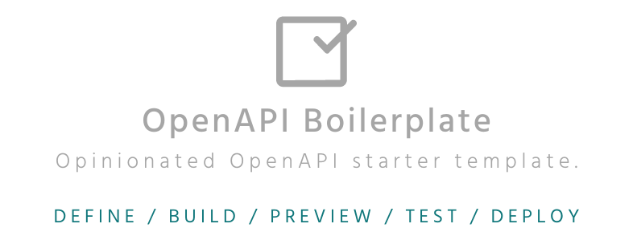

<h1 align="center">
  <div style="display:inline-block;vertical-align: middle;">
      
  </div>
</h1>


[](https://opensource.org/licenses/MIT)

# OpenAPI boilerplate

A starter template for **OpenAPI Specification** (OAS) projects.

This project splits the [Swagger Petstore](https://petstore.swagger.io/) example from the official documentation into smaller files. It also adds handy commands to build, lint, and preview the OpenAPI document from the terminal.

You can use this template to guide the organization of your project. Either if you want to create a new OpenAPI document from scratch or if you already have it defined. 

## Features

* 📝 Write OpenAPI definitions in different files.
* 🔀 Combine all files with [APIDevTools/swagger-cli](https://github.com/APIDevTools/swagger-cli).
* ✅ Validate and lint the OpenAPI document with [stoplight/spectral](https://github.com/stoplight/spectral).
* ✨ Publish reference docs with [redocly/redoc](https://github.com/Redocly/redoc) & GitHub Pages.

## Why?

When I used to document APIs following the OpenAPI spec, I always ended up with documents of thousands of lines, which were a nightmare to maintain.

For this reason, I explored how to split OpenAPI documents. Jump over to my [blog](https://davidgarcia.dev/posts/how-to-split-open-api-spec-into-multiple-files/) to learn more about the process. Based on my research, I created this opinionated template to define, test, and publish modular OpenAPI projects.

Properly organizing your project comes with great advantages. By splitting a large OpenAPI spec into multiple files, it will not only be much easier to handle. Documenting it will be much more enjoyable, too. I also regularly get the feedback that other developers are more willing to contribute and propose changes to the document with this structure.

## Getting started

### Requirements

* Node.js 16 (current)

### Installation

1. Clone the repository.

    ```
    git clone https://github.com/dgarcia360/openapi-boilerplate.git
    ```

2. Install the project dependencies.

    ```
    npm install
    ```

3. Edit `openapi.yaml` to fit your API definition. If you’re not familiar with the OpenAPI Specification, read [Getting started with OAS](https://swagger.io/solutions/getting-started-with-oas/) first.

## Useful commands

The project will build, lint, and preview the OpenAPI document from the terminal, with the following commands:

### Build

The command bundles the spec as one `.yaml` file.

```
npm run build
```

The minified document is stored in `_build/openapi.yaml`.

### Test

The command checks if the document follows the OpenAPI 3.0 Specification.

```
npm run test
```

### Preview

The command builds a docs site so that you can view the rendering on your local browser.

```
npm run preview
```

The server starts on http://127.0.0.1:8080.

The site is generated with [ReDoc](https://github.com/Redocly/redoc).
Here's a preview of a site generated with this command: [Swagger Petstore Reference Documentation](https://dgarcia360.github.io/openapi-boilerplate/).

## Ready-to-use workflows

The project uses [GitHub Actions](https://github.com/features/actions) for Continuous Integration (CI).

On every new pull request, the OpenAPI document is linted with [spectral](https://github.com/stoplightio/spectral). If there are changes that introduce errors, the bot will highlight them replying to the pull request.

When the default branch (e.g. `master`) receives an update, a workflow automatically publishes the API reference documentation site to GitHub Pages.

See `.github/workflows` to customize the available workflows. If you don't plan to use GitHub to host your spec or prefer to keep docs private, delete the `.github` folder.

## Contributing

Contributions are welcome and appreciated! 
If you want to enhance the boilerplate, please read [CONTRIBUTING.md](CONTRIBUTING.md) file first.

## License

Copyright (c) 2019-present David Garcia ([@dgarcia360](https://davidgarcia.dev)). Licensed under the [MIT License](LICENSE.md).

The PetStore example used is derived from [OAI/OpenAPI-Specification](https://github.com/OAI/OpenAPI-Specification/blob/master/examples/v3.0/petstore.yaml), Copyright The Linux Foundation, Licensed under the [Apache License, Version 2.0](https://github.com/OAI/OpenAPI-Specification/blob/master/LICENSE).


